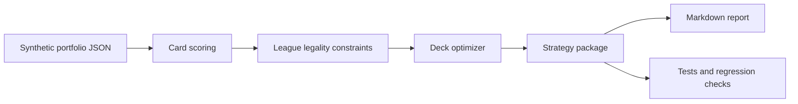

# Architecture

This public repository shows a compact version of the strategy pipeline.

## Production-inspired workflow

The private system used a broader version of this loop:

1. ingest portfolio and public market/game signals;
2. normalize cards, heroes, rarity, and league constraints;
3. estimate forward score and uncertainty;
4. optimize candidate deck packages;
5. flag market actions separately from deck recommendations;
6. generate a human-readable review report;
7. require human approval before any irreversible action.

## Design principles

- Human-in-the-loop by default.
- Synthetic fixtures in public artifacts.
- Fail closed when data is missing or inconsistent.
- Separate point estimates from risk-adjusted decisions.
- Keep reports concise enough for an operator to review quickly.

