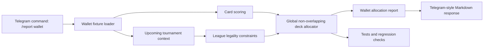

# Architecture

This public repository shows a compact wallet allocation pipeline with a
Telegram-style command interface.

## Production-inspired workflow

The private system used a broader version of this loop:

1. accept a wallet through Telegram;
2. ingest portfolio and public market/game signals;
3. identify the next tournament and league constraints;
4. normalize cards, heroes, rarity, stars, and eligibility;
5. estimate forward score and uncertainty;
6. allocate cards globally across all relevant leagues and deck slots;
7. flag market actions separately from deck recommendations;
8. generate a human-readable Telegram report;
9. require human review before irreversible actions.

## Public demo boundaries

The public demo keeps the product structure but removes live integrations:

- synthetic wallet fixture instead of live wallet/API access;
- synthetic tournament context instead of live Fantasy Top endpoints;
- compact global optimizer for the synthetic fixture instead of private
  production heuristics;
- local Telegram-command simulation instead of a real bot token.

## Design principles

- Wallet-first user flow.
- Human-in-the-loop by default.
- Synthetic fixtures in public artifacts.
- Fail closed when data is missing or inconsistent.
- Separate point estimates from risk-adjusted decisions.
- Keep reports concise enough for an operator to review quickly.
